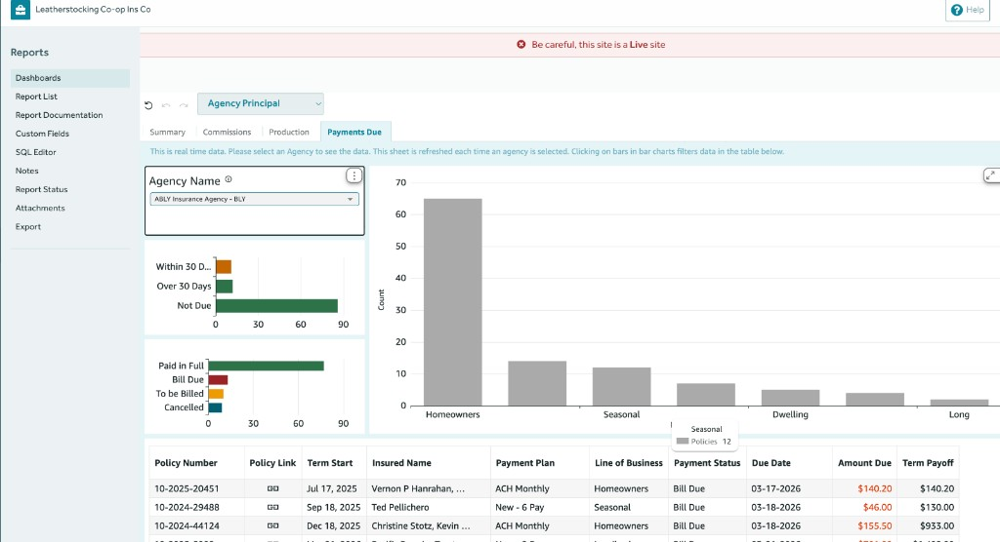

# Agency Principal Dashboard

**Location:** Reports → Dashboards → **Agency Principal** (selector: Claims Manager, CEO, Agency Principal, CFO, Underwriting Manager)

The Agency Principal dashboard gives an **agency-focused view** of commissions, production, payments due, and summary metrics. It has four tabs: **Summary**, **Commissions**, **Production**, and **Payments Due**. On every chart, **filtering**, **sorting**, **export to CSV or Excel**, and **expand to full screen** are available---see [Chart options (all dashboards)](dashboards.md#chart-options-all-dashboards) in the main doc.

**Why it matters for you:** Run your agency like a business. See commissions, production, and what's due from policyholders in one place---so you can grow the book, reward the right producers, and keep cash flow healthy without jumping between reports.

------------------------------------------------------------------------

## Summary tab

**Why this tab helps:** Track commission and loss trends over time with YTD and multi-year comparisons. Use it to plan ahead, compare this year to last, and have a single "state of the agency" view for yourself or your carrier.

The Summary tab shows commission paid YTD, commission paid over time, and 3-year month-to-month (M2M) and year-to-year (Y2Y) comparisons for policy and loss data. Use the controls to filter by agency, month, line of business, policy type, state, and lookback years.

### Controls

- **Month:** Selected month (e.g. 2/2026).
- **Agency Name:** Filter by agency (e.g. "All" or a specific agency).
- **Line of Business:** Filter by line (e.g. "All" or a specific line).
- **Policy Type:** Filter by policy type (e.g. "All" or a specific type).
- **State:** Filter by state (e.g. "All" or a specific state).
- **Years Look Back:** Number of years to include in comparisons (e.g. 3).

Toolbar: undo, redo, settings (gear), Save Settings, Reset.

### Section: Summary for \[Agency/All\]

Instruction: *"Please use the sheet controls to filter data by Agency, Month etc."*

### Charts and tables

1.  **Commission Paid YTD (Year-to-Date)**\
    Large summary box. Shows year-to-date commission paid; may display "No data." when there is none for the selected filters.\
    **Why it matters (Agency Principal):** Your at-a-glance answer to "How much have we earned this year?"---so you can track agency revenue and plan ahead.

2.  **Commission Paid over Time**\
    Small summary table with time-period columns (e.g. "Apr 2025", "Nov 2024"). Rows: **Current Year**, **Previous Year**, **Change**. Values are dollar amounts (e.g. (\$7.58), \$210.30). Previous Year and Change may be empty.\
    **Why it matters (Agency Principal):** See if commission is trending up or down vs. last year---so you can correct course or celebrate growth.

3.  **3-Year M2M Comparison (Month-to-Month -- Detailed Policy Data)**\
    Table: one row per month (e.g. Feb 2025, Feb 2024).\
    **Columns:** Month \| Inforce Count \| New Count \| Reinstated Count \| Canceled Count \| New Written \| Renewal Written \| Endorsed Written \| Canceled Written \| Reinstated Written \| Written Premium \| Earned \| % Change.\
    Shows policy counts and written/earned premium by month. Table options (e.g. sort, filter) may appear next to the title.\
    **Why it matters (Agency Principal):** Month-by-month view of how the book and premium are moving---so you can spot seasonality and plan for carrier conversations.

4.  **3-Year M2M Comparison (Month-to-Month -- Loss Data)**\
    Table: one row per month.\
    **Columns:** Month \| Loss Paid \| Loss Incurred \| Active Claims \| Reported Claims \| Loss Ratio.\
    Shows loss and claim activity by month.\
    **Why it matters (Agency Principal):** Connects your production to loss experience over time---so you can speak to combined ratio and loss trends with your carrier.

5.  **3-Year Y2Y Comparison (Year-to-Year -- Detailed Policy Data)**\
    Table: one row per year (e.g. 2025, 2024).\
    **Columns:** Year \| Inforce Count \| New Count \| Reinstated Count \| Canceled Count \| New Written \| Renewal Written \| Endorsed Written \| Canceled Written \| Reinstated Written \| Written Premium \| Earned \| % Change.\
    Same policy metrics as M2M but at year level.\
    **Why it matters (Agency Principal):** Year-over-year story for planning and carrier reviews---so you can show growth or explain variance with data.

6.  **3-Year Y2Y Comparison (Year-to-Year -- Loss Data)**\
    Table: one row per year.\
    **Columns:** Year \| Loss Paid \| Loss Incurred \| Active Claims \| Reported Claims \| Loss Ratio.\
    Same loss metrics as M2M but at year level.\
    **Why it matters (Agency Principal):** Puts loss and ratio in a year lens---so you can align with carrier expectations and underwriting discussions.

------------------------------------------------------------------------

## Commissions tab

**Why this tab helps:** See who earns what and on which policies---so compensation is fair, producer conversations are grounded in data, and you can spot top performers or correct course when commission doesn't match production. The detail table supports exports for payroll or carrier reporting.

The Commissions tab shows **commission details** over a 3-year window: total commissions by line of business (pie chart), top 10 agents by commission paid (bar chart), and a detailed table of commission entries by month, agency, agent, policy, and term. Use the controls to filter by month, agency, line of business, policy type, and state. CSV export is available; notifications ("Working on your CSV file" / "Your CSV is ready") may appear.

### Controls

- **Month:** Selected month (e.g. 2/2026).
- **Agency Name:** Filter by agency (e.g. "All" or a specific agency).
- **Line of Business:** Filter by line (e.g. "All" or a specific line).
- **Policy Type:** Filter by policy type (e.g. "All" or a specific type).
- **State:** Filter by state (e.g. "All" or a specific state).

Same toolbar as Summary (undo, redo, settings, Save Settings, Reset).

### Section: Commission Details for \[Agency/All\]

Instruction: *"Please use the sheet controls to filter data by Agency, Month etc."*

### Charts and table

1.  **3-Year Total Commissions Paid by Lines of Business**\
    Pie chart showing the share of total commissions by line of business (e.g. Personal Homeowners \$202.72 (100%)). One slice per line; values and percentages may sum to 100%.\
    **Why it matters (Agency Principal):** See which lines drive commission---so you can balance production and align incentives with where you want to grow.

2.  **3-Year Top 10 Agents for All Lines of Business**\
    Horizontal bar chart. X-axis: **Commission Paid (Sum)** (e.g. \$0 to \$250). One bar per agent (e.g. "Agent Steward (123456)" \$202.72). Chart options (e.g. sort, export) may appear at the bottom right.\
    **Why it matters (Agency Principal):** Recognize top producers and spot who needs support---so compensation and coaching are fair and data-driven.

3.  **3-Year Commission Details for All Lines of Business**\
    Detailed table; one row per commission record. Horizontal scroll for all columns. Data reflects the selected filters (month, agency, line, policy type, state). **Link** opens the policy in BriteCore.\
    **Why it matters (Agency Principal):** Audit trail for who earned what and on which policy---so payroll, carrier reporting, and producer conversations are accurate.\
    **Columns:**

| Column | Description |
|---|---|
| Month | Commission period (date). |
| Agency Group | Agency group name and code (e.g. Agency Insurance Group (0002-000-0000)). |
| Agency Name | Agency name and code (e.g. Agency Services (0002-000-0000)). |
| Agent Name | Agent name and identifier (e.g. Agent Steward (123456)). |
| Policy Number | Policy identifier (e.g. P-2024-5). |
| Link | URL to the policy in BriteCore. |
| Line of Business | Product line (e.g. Personal Homeowners). |
| Insured Name | Named insured. |
| Term Start - End | Policy term (e.g. 18/Nov/2024 - 18/Nov/2025). |
| Composite Commission Rate | Commission rate applied (e.g. 0.1 = 10%). |
| Commission Paid | Commission amount paid (can be negative e.g. -7.58). |
| Premium | Associated premium amount. |

------------------------------------------------------------------------

## Production tab

**Why this tab helps:** Understand how quotes turn into policies---by agency or agent---and how in-force count and premium are trending. Use it to see where conversion is strong or weak, where to coach or invest, and how the book is growing month over month.

The Production tab shows **agency productivity** over a 3-year window: quoting activity (started, quoted, submitted, issued, canceled), quote conversion by agency, month-to-month in-force policy count and premiums by agency, and quote status by zip code. Use the controls to filter by month, agency, line of business, and policy type, and to group by Agency or Agent. CSV export may show "Working on your CSV file" / "Your CSV is ready."

### Controls

- **Month:** Selected month (e.g. 2/2026).
- **Group By:** Agency (or Agent) -- controls how data is grouped in the tables.
- **Agency Name:** Filter by agency (e.g. "All" or a specific agency).
- **Line of Business:** Filter by line (e.g. "All" or a specific line).
- **Policy Type:** Filter by policy type (e.g. "All" or a specific type).

Same toolbar as other tabs (undo, redo, settings, Save Settings, Reset).

### Section: Agency Productivity

Instruction: *"Please use the sheet controls to see data grouped by Agency or Agent and to filter data by Agency, Month etc."*

### Tables

1.  **3-Year Quoting Activities by Agency for All Lines of Business**\
    Rows: **Total**, **2025**, **2024** (or by year within the 3-year lookback).\
    **Columns (Quote Status):** Started \| Quoted \| Submitted \| Issued \| Canceled.\
    Counts of quotes at each stage (e.g. Total: Started 123, Quoted 102, Submitted 52, Issued 157, Canceled 3). Use to see quote funnel volume over time.\
    **Why it matters (Agency Principal):** See where quotes are in the pipeline---so you can fix bottlenecks and grow issued count.

2.  **3-Year Quote Conversion by Agency for All Lines of Business**\
    One row per agency (e.g. Agency Services (0002-000-0000), Test Agency).\
    **Columns:** Agency \| Quoted \| Issued \| Conversion Rate \| Quoted Premium \| Issued Premium.\
    Conversion Rate = Issued / Quoted (e.g. 40.48%, 64.52%). Table options (expand/collapse, filter, menu) may appear next to the title.\
    **Why it matters (Agency Principal):** Compare which agencies (or agents) convert best---so you can invest in training or process where it pays off.

3.  **3-Year M2M Inforce Policy Count and Premiums by Agency for All Lines of Business**\
    One row per agency plus **Total** and **Not Assigned**.\
    **Columns:** For each month (e.g. Feb 2025, Feb 2024): **Policy** (count) \| **Premium** (dollar amount).\
    Shows in-force policy count and premium by agency and month (e.g. Total Feb 2025: 114 policies, \$378,300+ premium).\
    **Why it matters (Agency Principal):** Track how the book is growing or shrinking by agency and month---so you can manage to target and report to the carrier.

4.  **3-Year Quote Status by ZipCode for All Lines of Business**\
    Table of quote status or activity by zip code; extends below the fold. Structure may mirror quoting/conversion by geography. Scroll to see full columns and rows.\
    **Why it matters (Agency Principal):** See where quote activity is concentrated by geography---so you can align marketing and producer focus.

------------------------------------------------------------------------

## Payments Due tab

**Why this tab helps:** Know exactly what's due and from whom---by due date, billing status, and line of business. Use it to prioritize collections, reduce past-due exposure, and keep agency cash flow predictable. Real-time data refreshes when you select an agency.

The Payments Due tab shows **policies with current payments due** for the selected agency. Data is real time; the sheet refreshes when an agency is selected. **Select an agency** (not "All") to see data; with "All" the visuals show "No data." **Clicking a bar** in the bar charts filters the detail table below. CSV export may trigger "Working on your CSV file" / "Your CSV is ready."

### Controls

- **Agency Name:** Dropdown (e.g. "All" or a specific agency such as "ABLY Insurance Agency - BLY"). **Must select a specific agency** to see payments-due data; "All" returns no data for this report.

Same toolbar as other tabs (undo, redo, settings, Save Settings, Reset). Options at bottom right may include expand/collapse and a more-options menu.

### Section: Policies with Current Payments Due for \[Agency/All\]

Info banner: *"This is real time data. Please select an Agency to see the data. This sheet is refreshed each time an agency is selected. Clicking on bars in bar charts filters data in the table below."*

### Bar charts

When an agency is selected, three bar charts appear above the table. **Clicking a bar** filters the policy table below.

1.  **Payment Due Status** (horizontal)\
    Categories: **Within 30 Days** (orange) \| **Over 30 Days** (green) \| **Not Due** (dark green). X-axis: count (e.g. 0--90). Shows how many policies are due within 30 days, over 30 days, or not yet due.\
    **Why it matters (Agency Principal):** Prioritize collections---see how much is due soon vs. overdue so you can protect agency cash flow.

2.  **Policy Billing Status** (horizontal)\
    Categories: **Paid in Full** (dark green) \| **Bill Due** (red) \| **To be Billed** (orange) \| **Cancelled** (blue). X-axis: count. Shows count of policies by billing status.\
    **Why it matters (Agency Principal):** Know exactly how many policies need a bill, are past due, or are paid---so you can chase the right balances and keep receivables predictable.

3.  **Line of Business** (vertical)\
    Y-axis: Count (e.g. 0--70). One bar per line of business (e.g. Homeowners, Seasonal, Dwelling, Landlords, Manufactured). Tooltips show exact policy count (e.g. "Policies 12"). Use to see volume by LOB; clicking a bar filters the table.\
    **Why it matters (Agency Principal):** See which lines drive your payments-due exposure---so you can focus collection efforts where the money is.

### Detail table: Policies with current payments due

One row per policy. Filtered by the bar chart you click (payment due status, billing status, or line of business). **Policy Link** opens the policy in BriteCore.\
**Why it matters (Agency Principal):** The actionable list---who owes what and when---so you can collect efficiently and keep agency cash flow healthy.

| Column | Description |
|---|---|
| Policy Number | Policy identifier (e.g. 10-2025-20451). |
| Policy Link | URL to the policy in BriteCore. |
| Term Start | Policy term start date (e.g. Jul 17, 2025). |
| Insured Name | Named insured(s). |
| Payment Plan | Plan type (e.g. ACH Monthly, New - 6 Pay, New - 2 Pay). |
| Line of Business | Product line (e.g. Homeowners, Seasonal, Landlords, Manufactured). |
| Payment Status | e.g. Bill Due, Paid in Full, To be Billed, Cancelled. |
| Due Date | Next or current payment due date. |
| Amount Due | Dollar amount due (e.g. \$140.20); may be highlighted in red when overdue or current. |
| Term Payoff | Total amount to pay off the term. |

------------------------------------------------------------------------
