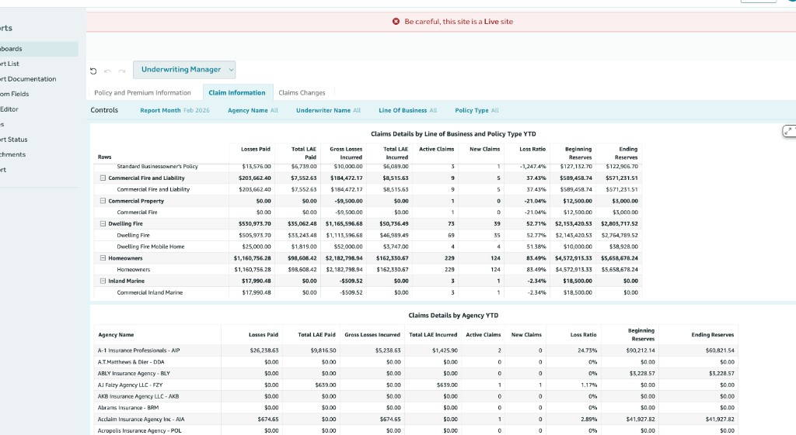

# Underwriting Manager Dashboard

**Location:** Reports → Dashboards → **Underwriting Manager** (selector: Claims Manager, CEO, Agency Principal, CFO, Underwriting Manager)

**URL (product demo):** `https://yoursitename.britecore.com/britecore/reports/analytic_dashboards`

The Underwriting Manager dashboard focuses on **policy and premium information**, **claim information**, and **claims changes**. It has three tabs: **Policy and Premium Information**, **Claim Information**, and **Claims Changes**. On every chart, **filtering**, **sorting**, **export to CSV or Excel**, and **expand to full screen** are available—see [Chart options (all dashboards)](dashboards.md#chart-options-all-dashboards) in the main doc.

**Why it matters for you:** Balance growth and risk with clear views of where premium and claims concentrate. See book composition, high-loss zip codes, repeat claimants, and loss ratios by line and agency—so you can sharpen guidelines, pricing, and underwriting focus without guessing.

---

## Policy and Premium Information tab

**Why this tab helps:** See how the book is built—policy count and premium by line and type—and where risk shows up: claims by insured, repeat offenders over time, and loss ratio by zip. Use it to spot concentration, target underwriting actions, and support territory or product decisions with data.

The Policy and Premium Information tab shows policy counts and premium by line of business and policy type, claims count by contact (insured), repeat offenders over time, loss ratio by zip code, and a detail table filterable by zip code (and by selection in the bar chart). Use the controls to filter by report month, agency, underwriter, line of business, and policy type.

### Controls

- **Report Month:** Month for the report (e.g. Feb 2026).
- **Agency Name:** Filter by agency (e.g. “All” or a specific agency).
- **Underwriter Name:** Filter by underwriter (e.g. “All” or a specific underwriter).
- **Line Of Business:** Filter by line (e.g. “All” or a specific line).
- **Policy Type:** Filter by policy type (e.g. “All” or a specific type).
- Additional control may appear (e.g. “Y” column or indicator).

Toolbar: settings (gear), Save Settings, Reset.

### Charts and table

1. **Policy Count by Line of Business / Policy Type**  
   Panel with drill-down. When there is no data for the selected filters, shows *“No data. There was no data found for the visual.”* Use to see policy counts broken down by line of business and policy type when data exists.

2. **Premium by Line of Business / Policy Type**  
   Panel with drill-down. When there is no data, shows *“No data.”* Use to see premium broken down by line of business and policy type when data exists.

3. **3 Years Look Back Claims Count by Contact**  
   Horizontal bar chart. **Y-axis:** Insured Name. **X-axis:** Claims Count (e.g. 0 to 100). Subtitle: *“Drill down to claims count by Adjuster and Underwriter.”* One bar per insured; **selecting an insured** filters the “Repeat Offenders In Time” visual on the right. Example data: BOBBIE A SHAFFER 95, Rebecka Test 28, Sam Pellegrino 7, John Doe 4, etc.

4. **Repeat Offenders In Time**  
   Line chart. **X-axis:** Loss Date (Month) (e.g. 2017–2020). **Y-axis:** Scale (e.g. 0–100). Multiple lines by **Insured Name**; legend lists insureds. Instruction: *“Select an insured name on the Bar visual on the left to filter this visual.”* Shows loss/claim history over time for the selected insured(s).

5. **Loss Ratio by Zip code**  
   Map or chart by zip code. When there is no data, shows *“No data.”* When configured, **selecting a zip code** filters the detail table below. (Map may be in the same tab or linked.)

6. **Detail table (filtered by Zip Code / map)**  
   Instruction above table: *“Select a Zip Code on the map to filter this table.”*  
   **Columns:** Zip Code | Agency Name | Adjuster Name | Underwriter Name | Policy Number.  
   One row per policy; Zip Code may include “null.” Agency Name (e.g. Agency Services (0002-000-0000), Test Agency), Adjuster Name (e.g. Not Assigned, Chad Allan, Rebecka Nawrocki), Underwriter Name (e.g. Not Assigned, Chad Allan), Policy Number (e.g. P-2025-4, Q-2024-34). Table is filtered by the zip code selected on the map (or shows full set when no map selection).

---

## Claim Information tab

**Why this tab helps:** See loss and LAE by line, policy type, and agency in one place. Use it to tighten guidelines, adjust pricing, and have evidence-based conversations with underwriting and claims—so risk selection and retention decisions are grounded in current loss experience.

The Claim Information tab shows **claims details year-to-date (YTD)** in two tables: one by **line of business and policy type** (with expandable rows), and one by **agency**. When there is no data for the selected filters, each table shows *“No data. There was no data found for the visual.”*

### Controls

Same as Policy and Premium Information: **Report Month** (e.g. Feb 2026), **Agency Name**, **Underwriter Name**, **Line Of Business**, **Policy Type**. Same toolbar (settings, Save Settings, Reset).

### Table 1: Claims Details by Line of Business and Policy Type YTD

Aggregated claims data YTD, broken down by line of business and policy type. Rows can be **expandable**: a line of business (e.g. Commercial Fire and Liability, Dwelling Fire, Homeowners, Inland Marine) expands to show sub-rows by policy type (e.g. Commercial Fire, Dwelling Fire, Dwelling Fire Mobile Home, Commercial Inland Marine). Some rows are a single policy type (e.g. Standard Businessowner's Policy).

**Columns:**

| Column                  | Description |
|-------------------------|-------------|
| Rows                    | Line of business and/or policy type (expandable hierarchy). |
| Losses Paid             | Total losses paid YTD (dollars). |
| Total LAE Paid          | Total loss adjustment expense paid YTD (dollars). |
| Gross Losses Incurred   | Gross losses incurred YTD (dollars). |
| Total LAE Incurred      | Total LAE incurred YTD (dollars). |
| Active Claims           | Count of active claims. |
| New Claims              | Count of new claims. |
| Loss Ratio              | Loss ratio (percentage; can be negative e.g. -1,247.4% in some cases). |
| Beginning Reserves      | Beginning reserves (dollars). |
| Ending Reserves         | Ending reserves (dollars). |

### Table 2: Claims Details by Agency YTD

Same metric columns as Table 1, with one row per **agency** (e.g. A-1 Insurance Professionals - AIP, ABLY Insurance Agency - BLY). Icons next to the title: expand/collapse, download, filter, more options.

**Columns:**

| Column                  | Description |
|-------------------------|-------------|
| Agency Name             | Agency name (e.g. A-1 Insurance Professionals - AIP). |
| Losses Paid             | Total losses paid YTD (dollars). |
| Total LAE Paid          | Total LAE paid YTD (dollars). |
| Gross Losses Incurred   | Gross losses incurred YTD (dollars). |
| Total LAE Incurred      | Total LAE incurred YTD (dollars). |
| Active Claims           | Count of active claims. |
| New Claims              | Count of new claims. |
| Loss Ratio              | Loss ratio (percentage). |
| Beginning Reserves      | Beginning reserves (dollars). |
| Ending Reserves         | Ending reserves (dollars). |

---

## Claims Changes tab

**Why this tab helps:** Track how claims and reserves change over time—so you can tie underwriting and policy changes to claim outcomes and reserve movements. Use it to validate pricing and guidelines and to explain loss and reserve trends to leadership. (Full tab documentation in progress.)

---

*Documentation based on yoursitename.britecore.com and live data. Policy and Premium Information and Claim Information documented with full table columns; Claims Changes in progress.*
